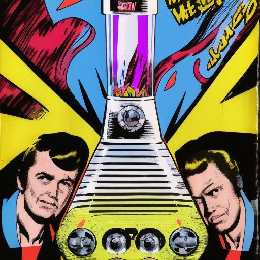

# Games Engines 1 Assignment 2022-2023 - The Six Million Dollar Man's Lava Lamp

Your task is to create an interactive hologram of a cool thing inspired by vintage sci-fi. 

You can use [ProBuilder](https://unity.com/features/probuilder) or [Blender](https://www.blender.org/) to make your models, or like me, create everything from primitives or procedurally. Another option is to [use AI](https://www.youtube.com/watch?v=ooSW5kcA6gI). We will deploy the holograms to the Quest. You can use any of built in stuff in Unity, such as particle effects, shaders, sound, the animation system and C# scripts. Your hologram should move or have and have behavior and interaction. You can use source code and assets from other projects, but you must reference these in your documentation (see [here](assignmentreadme.md) for a template).

Some ideas:

- This thing for holding the Medusan Ambassador from Star Trek:

- This cool thing from Joe 90:

- The teleporter from the movie "the Fly"

- The six million dollar mans lava lamp
- A self playing guitar or piano
- A volcano
- A fire place with futuristic effects
- A harry potter style book or picture that comes to life
- An alien in a jar
- AN R2D2 type robot
- An abstract audio responsive artwork
- An octopus in a tank
- A transporter
- A futuristic kitchen appliance
- A giant talking head
- A futuristic machine with lots of lights and moving parts

Please include a detailed readme.md in your git repo. Here is [a template](assignmentreadme.md)

# Due dates:
- Week 8 - Proposal & git repo - [Submit proposal here](https://forms.office.com/Pages/ResponsePage.aspx?id=yxdjdkjpX06M7Nq8ji_V2ou3qmFXqEdGlmiD1Myl3gNUQlhURzM4MzFWSTdDTDlERFdZTkw2UThQTS4u)
- Week 13 - Final submission & in-class, in-person demos
 
 # Weighting

| Category | Weighting |
|-|-|
| Complexity | 30% |
| Groovyness | 30%  |
| Project management & documentation | 30% |
| Proposal | 10% |
 
 | Grade | Complexity |
 |-------|------------|
 | 1 | 15-20 hours work. A complex system that has lots of interactivity. 5 or 6 MonoBehaviors that interact and work together to implement the system. A complex algorithm such as a generative system. Several hundred lines of self written C# code. Nice gizmos on all the MonoBehaviors and ranges on public fields, where appropriate. Code will be separated into appropriate methods and classes, following SOLID principles. Code demonstrates techniques we have learned on the course including: coroutines, transforms, vectors, quaternions, physics, lerping and slerping, sound. Advanced use (such as scripting) of Unity systems including animation, shaders, particle systems. Deployed and demoed on the quest or in AR on a phone. |
 | 2.1 | 10-15 hours work. A less complex system that has some simple interactivity. 2 or 3 new MonoBehaviors required to implement the system. No gizmos. Long methods. Around 100 lines of C#. Using some of the techniques we learned on the course such as manipulating the transform. Working on PC, not VR. |
 | 2.2 | 5-10 hours work. A simple system with a script or two based on modifying the transform or something very basic implemented like a spiral or a simple voxel world. Or most of the functionality is derived from tutorials with little customization or understanding. Little interactivity. Works in Unity editor, but not tested as a build or on device. No use of other Unity systems. Random colors. No audio or inappropriate audio. |
 | Pass | < 5 hours work. A single C# script or all from a tutorial. Compiles and runs |
| Fail | No submission or nothing works |

| Grade | Groovyness |
|-------|------------|
| 1     | Project is deployed to the Quest and has great framerate. It looks amazing with a high level of polish on the visuals. Great use of color and form. The object is fully usable in VR and AR. There is lots of functionality and interactivity - for example buttons to press, levers to turn, colors changing, movement, animation etc. Lots of novelty and nostalgia. Use of visual effects such as particle system, post-processing or custom shaders to enhance visual quality. Has a clear visual style. Has great sound effects. Is very cool indeed. Super cool in fact. Special gold star just like Joe 90. |
| 2.1 | Maybe deployed to the Quest but has some glitches or runs just on PC not in AR. Looks pretty good with decent but simple self made models made in ProBuilder or Blender. No visual effects. Maybe a particle system. Sound effects grabbed from online sources. Some simple interactivity and button presses. Less coherent visual style. Good novelty value. |
| 2.2 |  One or two simple models made in ProBuilder or imported from online sources. No interactivity, just an animated visual. Running in the Unity editor. Little or no sound |
| Pass | Model from online source or primitive that does not do anything |
| Fail | Does not compile or little or no content |

| Grade | Project Management & Documentation |
|-------|------|
| 1 |  Detailed initial proposal and plan. 30-40 commits. Feature branches. For team projects, an equal distribution of the commits. Commits all commented. All sections of the template filled out. Document includes reflective elements - What did I learn? Sources properly referenced. Embedded, public, listed youtube video (DO NOT CHECK THIS VIDEO IS MADE FOR KIDS). The video is made from a build, not from the Unity Editor and demonstrates all the features of your project |
| 2.1 | 20-30 commits. One or two branches. All sections of the template filled out. Sources properly referenced. Issues with the video. 
| 2.2 |10-20 commits, terse or no comments. No branches. Documentation incomplete, Evidence of reflective learning missing. missing references. Issues with the video |
| Pass | < 10 commits. terse or no comments. No branches. Documentation incomplete. No video |

Examples from previous years:
- [https://youtube.com/playlist?list=PL1n0B6z4e_E5naCKOJDfU-sgX_3CdlRfN](2020-2021)
- [https://youtube.com/playlist?list=PL1n0B6z4e_E6GaGOHiBdPSW0QzICdGs4X](2019-2020)
- [https://youtube.com/playlist?list=PL1n0B6z4e_E5qaYwUOlJ63XI2OR9ty7Bs](2018-2019)